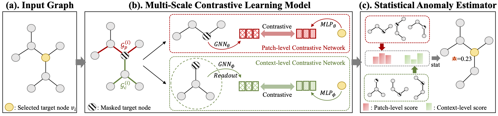

# ANEMONE

A PyTorch implementation of "[ANEMONE: Graph Anomaly Detection with Multi-Scale Contrastive Learning](https://shiruipan.github.io/publication/cikm-21-jin/)", CIKM-21

<p align="center">

</p>

## Dependencies
+ python==3.6.1
+ dgl==0.4.1
+ matplotlib==3.3.4
+ networkx==2.5
+ numpy==1.19.2
+ pyparsing==2.4.7
+ scikit-learn==0.24.1
+ scipy==1.5.2
+ sklearn==0.24.1
+ torch==1.8.1

To install all dependencies:
```
pip install -r requirements.txt
```

## Usage
Anomalies have been injected into three datasets under the `./dataset` directory. 
Please refer to [GRAND-Lab/CoLA](https://github.com/GRAND-Lab/CoLA) for graph anomaly injection.

To train and evaluate on Cora:
```
python run.py --expid 1 --device cuda:0 --runs 1 --alpha 0.8
```
To train and evaluate on Citeseer:
```
python run.py --dataset citeseer --expid 2 --device cuda:0 --runs 1 --alpha 0.6
```
To train and evaluate on Pubmed:
```
python run.py --dataset pubmed --expid 3 --device cuda:0 --runs 1 --alpha 0.8 --negsamp_ratio_patch 6 --negsamp_ratio_context 1
```

## Citation
If you use our code in your research, please cite the following article:
```
@inproceedings{jin2021anomaly,
  title={ANEMONE: Graph Anomaly Detection with Multi-Scale Contrastive Learning},
  author={Ming Jin and Yixin Liu and Yu Zheng and Lianhua Chi and Yuan-Fang Li and Shirui Pan},
  booktitle={Proceedings of the 30th ACM International Conference on Information \& Knowledge Management},
  year={2021}
}
```
